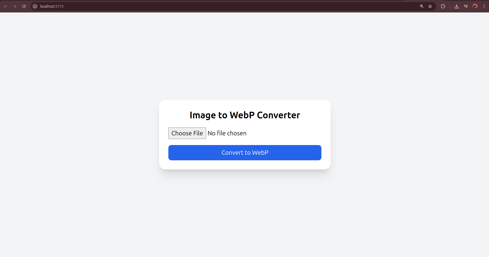

# WebP Image Converter 🖼️➡️🕸️

A clean and simple React-based web app to convert any image (PNG, JPG, etc.) to WebP format right in your browser — no server required.

Perfect for optimizing images for your portfolio website, reducing image size while maintaining quality!

## 🚀 Features

- 📤 Upload any image from your device
- 🖼️ Preview the uploaded image
- 🔁 Convert it to high-quality WebP format using Canvas API
- 📥 Download the converted `.webp` image
- ⚡ Fast, lightweight, and works offline once loaded
- 🎨 Built with Vite + Tailwind CSS for a smooth experience

## 📸 Why I Built This

I created this tool for personal use — to convert and compress images before adding them to my portfolio website. WebP drastically reduces image sizes and helps in improving page load speed.

## 🛠️ Tech Stack

- [React](https://reactjs.org/)
- [Vite](https://vitejs.dev/)
- [Tailwind CSS](https://tailwindcss.com/)
- HTML5 Canvas API

## 🧑‍💻 Getting Started

### 1. Clone the Repo

```bash
git clone https://github.com/abhisheksmandal/webp-image-converter.git
cd webp-image-converter
```

### 2. Install Dependencies

```bash
npm install
```

### 3. Run the App Locally

```bash
npm run dev
```

Visit [http://localhost:5173](http://localhost:5173) to see it in action.

## 🖥️ Usage

1. Upload an image (JPEG, PNG, etc.)
2. Click **Convert to WebP**
3. Click **Download WebP Image** to save it

## 📁 Project Structure

```
📦 image-to-webp-converter
├── public/
├── src/
│   ├── App.jsx         # Main component
│   ├── main.jsx        # Entry point
│   └── index.css       # Tailwind styles
├── index.html
├── tailwind.config.js
├── package.json
└── vite.config.js
```

## 🌐 Live Demo

> Deploy it on [Vercel](https://vercel.com/) or [Netlify](https://netlify.com/) for free hosting  
> _Coming Soon: [https://yourdomain.com](https://yourdomain.com)_

## ✅ To Do (Optional Improvements)

- [ ] Drag-and-drop image support
- [ ] Image compression quality control
- [ ] Support for converting multiple images
- [ ] Backend (Python/Node) for large files

## 📸 Screenshot



---

Made with ❤️ by Abhishek Mandal (https://abhishek-mandal.netlify.app/)
